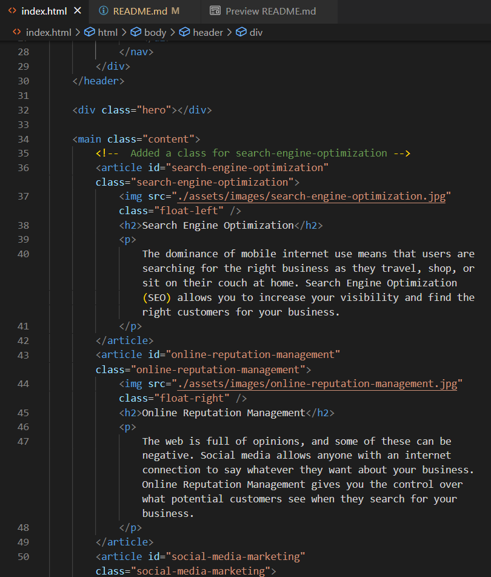

# seo-refactor-exercise

## Name
SEO Refactor Exercise

## Description
Updated tags within html coding to provide semantic value. Updated CSS coding to help the webpage load faster by increasing bandwidth and reducing the overall size of the information to process.

## Links
[Source Code](https://github.com/asantercureton/seo-refractor-exercise)

[Description Link](https://asantercureton.github.io/seo-refractor-exercise/)

## Usage
Replaced one <strong>div</strong> with <strong>nav</strong> to provide more semantic value and allow other develops to quickly identify where the navigation pane was within the code. Also applied appropiate semantic tags to replace the other <strong>div</strong> tags within the html code - reference 1st screenshot below.

## Screenshots
Below are a couple screenshots of the project html displaying tags with semantic value, as well as a peek of the website displaying resized images:

<!--  -->

<!-- -->

---
© 2021 SEO Refactor Exercise.